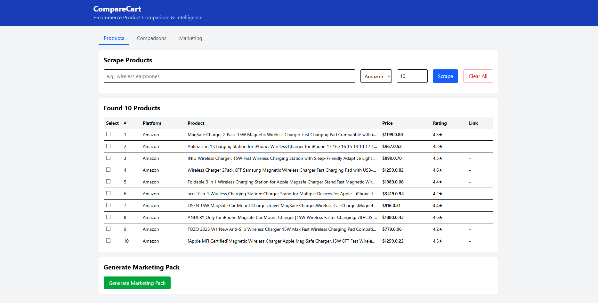
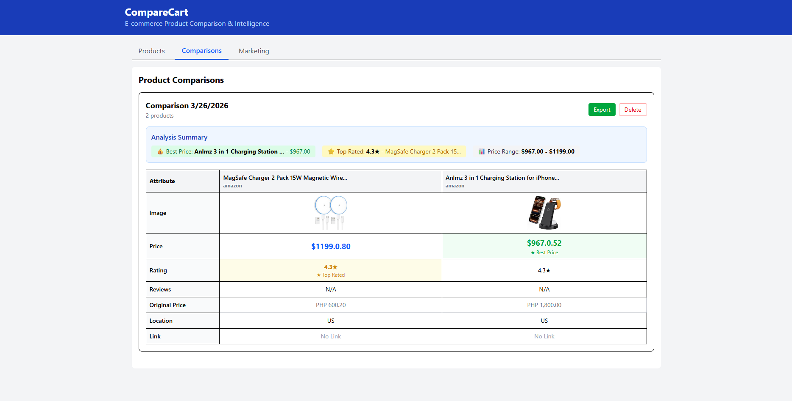
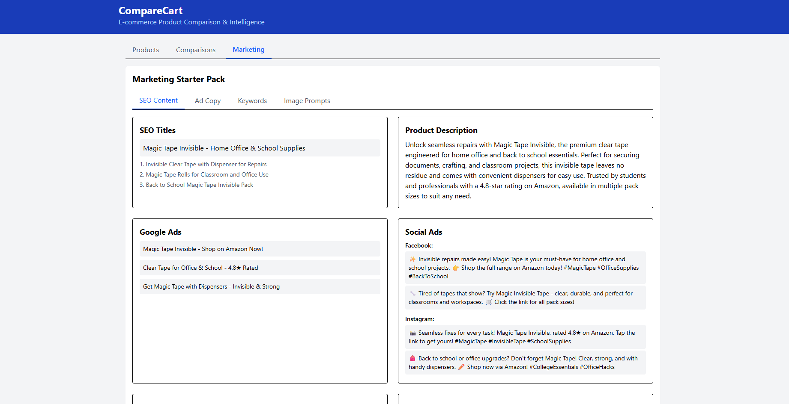

# CompareCart 🛒

E-commerce product comparison tool that scrapes prices from multiple platforms (Amazon, eBay, Walmart) and helps users find the best deals.





## Features

- **Multi-platform Scraping**: Compare prices from Amazon, eBay, and Walmart
- **Product Comparison**: View side-by-side price comparisons
- **AI-Powered Insights**: Get product recommendations using Claude AI
- **Modern UI**: Clean React frontend with real-time updates

## Project Structure

```
.
├── frontend/                  # React + Vite frontend
│   └── comparecart/
├── backend/                   # FastAPI backend
│   └── app/
│       ├── routers/          # API endpoints
│       ├── services/         # Business logic & scrapers
│       ├── models/           # Database models
│       └── schemas/          # Pydantic schemas
└── docs/                     # Documentation
```

## Setup

### Prerequisites

- Node.js 18+
- Python 3.10+
- Chrome browser (for scraping)

### Backend Setup

```bash
cd backend

# Create virtual environment
python -m venv venv

# Activate (Windows)
venv\Scripts\activate
# Or (Mac/Linux)
source venv/bin/activate

# Install dependencies
pip install -r requirements.txt

# Start server
python -m uvicorn app.main:app --reload
```

The backend runs at `http://localhost:8000`

### Frontend Setup

```bash
cd frontend/comparecart

# Install dependencies
npm install

# Start development server
npm run dev
```

The frontend runs at `http://localhost:5173`

### Environment Variables

Create a `.env` file in the `backend/` directory:

```
# Optional: For AI-powered insights
OPENROUTER_API_KEY=your_key_here
```

Get a free API key at https://openrouter.ai

## API Endpoints

| Method | Endpoint | Description |
|--------|----------|-------------|
| POST | `/api/scrape` | Scrape products from a platform |
| GET | `/api/products` | Get all stored products |
| POST | `/api/comparison` | Compare products by keyword |

## Usage

1. Start the backend: `uvicorn app.main:app --reload`
2. Start the frontend: `npm run dev`
3. Open `http://localhost:5173` in your browser
4. Enter a product keyword and select a platform to scrape
5. View and compare results

## Notes

- Without an API key, the scraper works but AI features use mock data
- Respect platform terms of service when scraping
- Scraping may require Chrome browser installed